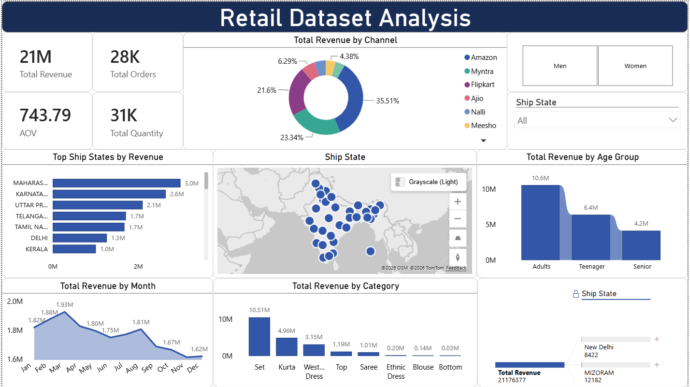
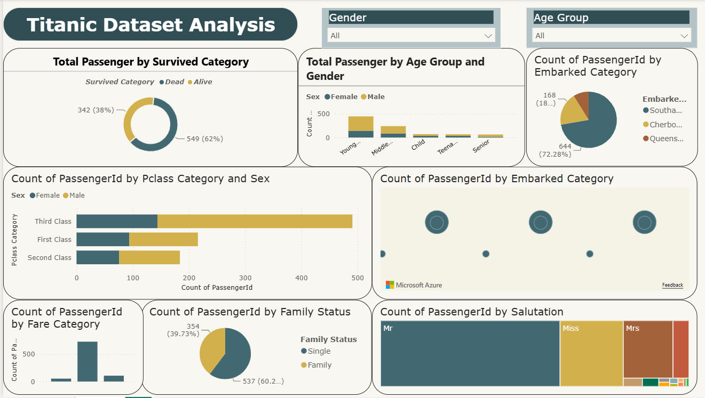

# Power BI Dashboards

Two interactive Power BI dashboards that show the full workflow from raw data to a modeled, business-ready report: data shaping in Power Query, a star-schema data model, DAX measures, and interactive visuals including geospatial maps and a decomposition tree.


## 1. E-commerce Sales Dashboard

`ecommerce-sales-dashboard.pbix`

A sales performance report built on a star schema with a `FactSales` fact table and DAX measures for revenue, orders, quantity, and average order value.

- KPI cards: total revenue, total orders, total quantity, and average order value
- Revenue trend by month, and revenue split by product category and sales channel
- Geospatial revenue by ship-to state using an Azure Map visual
- Revenue by customer age group and by state
- A decomposition tree that drills from state to category to channel, so a reviewer can explore what drives revenue interactively
- Slicers for ship-to state and gender

Skills shown: data modeling with a star schema, DAX measure design, and interactive drill-down and geospatial analysis.

## 2. Titanic Survival Dashboard

`titanic-survival-dashboard.pbix`

An exploratory dashboard on the classic public Titanic dataset, focused on which passenger attributes related to survival.

- Survival breakdown with engineered groupings: age group, family status, salutation extracted from name, fare band, and passenger class
- Survival and passenger counts by sex, class, embarkation point, and family status
- Slicers for sex and age group for quick filtering

Skills shown: data cleaning and feature grouping in Power Query, exploratory analysis, and clear visual storytelling.

## Screenshots

Power BI files do not preview on GitHub, so screenshots make the difference here. Drop a PNG of each dashboard into the `images/` folder, then uncomment the lines below in this README:

```markdown


```

A short GIF of the decomposition tree in action is also a strong addition if you want one.

## How to open

Open either `.pbix` file in [Power BI Desktop](https://powerbi.microsoft.com/desktop/) (free). The data model is embedded, so the report loads with its data.

## Repository structure

```
powerbi-dashboards/
  ecommerce-sales-dashboard.pbix
  titanic-survival-dashboard.pbix
  images/                          dashboard screenshots
  README.md
  LICENSE
```

## Data note

The Titanic dataset is public. The e-commerce dashboard uses a sample retail sales dataset for demonstration. No private or personally identifiable data is included.

## License

Released under the MIT License. See [LICENSE](LICENSE).
